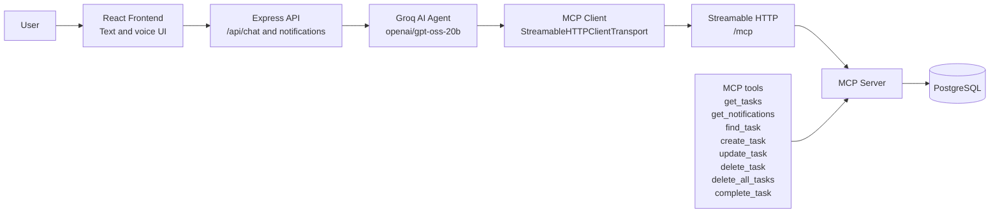

# Voxara

<p align="center">
  
  
  
  
  
  
  
  
</p>

> **An AI work assistant that turns natural-language conversations into actionable workflows.**

Voxara is a conversational work assistant built for the **Amazon Developer Hackathon**, targeting the **Alexa+ track**. Users can interact with Voxara through text or voice to manage tasks, reminders, notifications, and other work-related actions.

The project demonstrates an Alexa+-style conversational experience in a web application. A Groq-powered AI agent discovers and calls tools through a self-hosted **Model Context Protocol (MCP) server** over **Streamable HTTP**, while PostgreSQL provides persistence.

## Why Voxara?

Work management often requires users to navigate forms, menus, and separate reminder systems. Voxara lets users express intent naturally, such as “create a high-priority task to prepare the presentation for tomorrow,” and turns that request into a structured workflow.

The assistant keeps the AI layer separate from persistence. The agent decides which action is needed, but task data is read and changed through MCP tools rather than direct database manipulation.

## Features

- Natural-language task management
- Create tasks with a title, priority, and due date
- View pending and existing tasks
- Update task title, priority, or due date
- Complete tasks
- Delete individual tasks
- Delete all tasks with confirmation in the conversational flow
- Find tasks by title or keywords
- Notifications and task reminders
- Automatic reminder checking every minute
- Voice input with the Web Speech API
- Voice responses with the browser SpeechSynthesis API
- Conversation history and context
- Dynamic AI tool discovery through MCP
- PostgreSQL persistence
- Alexa-like assistant interface
- Responsive React UI

## Architecture



At runtime, the Node.js process hosts both the Express API and the MCP endpoint. The default MCP endpoint is `http://localhost:4000/mcp`.

## Tech Stack

| Layer | Technology |
| --- | --- |
| Frontend | React, Vite, Tailwind CSS |
| Backend | Node.js, Express.js |
| AI agent | Groq SDK with `openai/gpt-oss-20b` |
| Agent communication | Model Context Protocol (MCP) |
| MCP transport | Streamable HTTP |
| MCP server | Self-hosted MCP server using the MCP server packages |
| Database | PostgreSQL using `pg` |
| Voice input | Web Speech API |
| Voice output | Browser SpeechSynthesis API |
| Validation | Zod |

## How MCP Is Used

Voxara uses MCP as the boundary between the AI agent and work-data operations:

1. The frontend sends a user message and conversation history to `POST /api/chat`.
2. The Express backend passes the message to the Groq-powered agent.
3. The agent connects to the MCP server over Streamable HTTP and discovers the available tools.
4. The model selects a tool when the request requires an action or data lookup.
5. The MCP client calls the selected tool on the self-hosted MCP server.
6. The MCP server performs the PostgreSQL operation and returns structured tool output.
7. The agent produces a natural-language response for the frontend.

The AI agent does not manipulate PostgreSQL directly. The MCP server owns task and notification database operations.

### MCP Endpoint

```text
http://localhost:4000/mcp
```

### MCP Tools

| Tool | Purpose |
| --- | --- |
| `get_tasks` | Retrieve the current user's tasks |
| `get_notifications` | Retrieve unread reminders and notifications |
| `find_task` | Find tasks by title or keywords |
| `create_task` | Create a task with title, priority, and optional due date |
| `update_task` | Update an existing task's title, priority, or due date |
| `delete_task` | Delete one task |
| `delete_all_tasks` | Delete all tasks belonging to the current user |
| `complete_task` | Mark one task as completed |

## Project Structure

```text
Voxara/
├── backend/
│   ├── package.json
│   └── src/
│       ├── agent.js       # Groq agent and MCP client orchestration
│       ├── api.js         # Express chat and notification routes
│       ├── db.js          # PostgreSQL connection pool
│       ├── db-test.js     # PostgreSQL connectivity check
│       ├── reminder.js     # Reminder generation logic
│       └── server.js      # Express and MCP HTTP server
├── frontend/
│   ├── package.json
│   └── src/
│       ├── App.jsx        # Assistant UI and voice interaction
│       ├── index.css      # Global styles
│       ├── main.jsx       # React entrypoint
│       └── api/            # Backend API clients
├── LICENSE
└── README.md
```

## Prerequisites

- Node.js 18 or newer
- npm
- PostgreSQL 14 or newer
- A Groq API key
- A browser with Web Speech API support for voice input

## Environment Variables

Create `backend/.env` using placeholders for your local values:

```env
GROQ_API_KEY=your_groq_api_key
MCP_URL=http://localhost:4000/mcp

DB_USER=your_postgresql_user
DB_HOST=localhost
DB_NAME=voxara
DB_PASSWORD=your_postgresql_password
DB_PORT=5432
```

Create `frontend/.env` so the Vite app knows where the backend is running:

```env
VITE_API_URL=http://localhost:4000
```

Do not commit either `.env` file or real credentials.

## Local Setup

### 1. Clone the repository

```bash
git clone <your-repository-url>
cd Voxara
```

### 2. Backend setup

```bash
cd backend
npm install
```

### 3. PostgreSQL setup

Create a database named `voxara`, then connect to it and create the tables used by the application:

```sql
CREATE DATABASE voxara;
```

Run the following while connected to the `voxara` database:

```sql
CREATE TABLE tasks (
      id SERIAL PRIMARY KEY,
      user_id VARCHAR(100) NOT NULL,
      title VARCHAR(255) NOT NULL,
      priority VARCHAR(20) NOT NULL CHECK (priority IN ('low', 'medium', 'high')),
      status VARCHAR(20) NOT NULL DEFAULT 'pending',
      due_date TIMESTAMP NULL,
      created_at TIMESTAMP NOT NULL DEFAULT CURRENT_TIMESTAMP
);

CREATE TABLE notifications (
      id SERIAL PRIMARY KEY,
      user_id VARCHAR(100) NOT NULL,
      task_id INTEGER REFERENCES tasks(id) ON DELETE CASCADE,
      message TEXT NOT NULL,
      type VARCHAR(50) NOT NULL,
      is_read BOOLEAN NOT NULL DEFAULT FALSE,
      created_at TIMESTAMP NOT NULL DEFAULT CURRENT_TIMESTAMP
);
```

The current application simulates the signed-in user with the ID `user123`.

### 4. Configure environment variables

Add the backend and frontend environment files described above. The backend defaults to port `4000`; `MCP_URL` should point to the same process at `/mcp`.

### 5. Start the backend

From `backend/`:

```bash
npm start
```

This starts the Express API and MCP server together:

- API base URL: `http://localhost:4000`
- MCP endpoint: `http://localhost:4000/mcp`

For development with automatic restarts:

```bash
npm run dev
```

### 6. Frontend setup

Open a second terminal:

```bash
cd frontend
npm install
```

### 7. Start the frontend

From `frontend/`:

```bash
npm run dev
```

Open the local URL printed by Vite, typically `http://localhost:5173`.

## Example Conversations

Try commands such as:

```text
Create a high-priority task to prepare the demo for tomorrow.
Show my pending tasks.
Find the task about the demo.
Move the demo task to next Monday.
Mark the demo task as complete.
Show my reminders.
Delete the task about the demo.
Delete all my tasks.
```

Relative dates are interpreted using the current date and time supplied to the agent. Destructive requests such as deleting all tasks should be confirmed in the conversation before execution.

## Voice Interaction

Use the microphone control in the web interface to provide voice input. Voxara uses the browser's Web Speech API to transcribe speech. Responses are read aloud through the browser's SpeechSynthesis API, and newly detected notifications can also be spoken aloud.

Voice capabilities depend on browser support and permission to use the microphone. Text interaction remains available when voice APIs are unavailable.

## API and MCP Architecture

The frontend communicates with the backend through these HTTP routes:

| Route | Purpose |
| --- | --- |
| `POST /api/chat` | Process a message with optional conversation history |
| `GET /api/notifications` | Fetch unread notifications for `user123` |
| `PATCH /api/notifications/:id/read` | Mark a notification as read |
| `/mcp` | Streamable HTTP transport for MCP client-server communication |

The Express API handles frontend requests and delegates conversational reasoning to the agent. The agent connects to the MCP server, discovers its tools, and calls them as needed. The MCP server is responsible for executing PostgreSQL queries. This separation keeps the model focused on intent and tool selection while the server controls data access.

## Hackathon and Alexa+ Track Relevance

Voxara explores the Alexa+ idea of a more natural, context-aware assistant that can understand conversational requests and complete useful workflows. In this implementation, the experience is delivered through a responsive web application with both text and voice interaction.

The project uses MCP to make assistant capabilities explicit and callable as structured tools. It uses a self-hosted MCP server with Streamable HTTP to connect the Groq AI agent to PostgreSQL-backed task and notification workflows. No Amazon Alexa APIs, AWS Bedrock, AgentCore, or other AWS services are required by the current implementation.

## Future Improvements

- Replace the simulated `user123` identity with authentication and per-user data isolation.
- Add richer notification controls and configurable reminder schedules.
- Improve date and time handling across time zones.
- Add tests for MCP tools, API routes, agent tool selection, and reminder generation.
- Add a production deployment configuration and monitoring.
- Support additional work systems through more MCP servers and tools.

## License

Voxara is released under the MIT License. See the existing [LICENSE](LICENSE) file for the full license text.
```